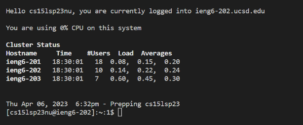
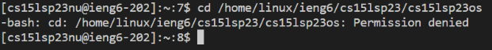

# Lab Report 1: Tutorial
## Part 1: 15l Account Setup
> [Account Lookup](https://sdacs.ucsd.edu/~icc/index.php)  
> Click on this link to reset password

1. Put in username (ex. "akhov" in akhov@ucsd.edu) & student id
2. Click on the cse15lsp23zz button ("zz" should be your own unique letters, this is your 15l username)
3. Click on the Password Change link, then proceed on clicking "Proceed to Password Change Tool"
4. Enter the 15l username and proceed with the link
5. Once the email with password instructions is sent, open it up and click on the link to the reset page
6. Enter your new password then press the Change Password button

## Part 2: Installling Visual Studio Code
(If you't dont need to or already have Visual Studio Code, you may skip this step)
> [Install Page](https://code.visualstudio.com/)  
>  Click on the link to enter install page

1. Simply follow the instructions provided on the page
2. When installed, Visual Studio Code should look something like this 

**Note:** Depending on the system and settings the color or menu bar may differ.

## Part 3: Remote Connection
> [Install Git](https://gitforwindows.org/)  
> Click on this link to install Git  

Simply follow the install instructions, don't overly worry on the options, the default choices should be fine

> [Setting up Bash](https://stackoverflow.com/a/50527994)  
> Follow the steps in the link  

1. To begin using `ssh` open a terminal in VScode (shortcut is **Ctrl or Command + `**, or use Terminal -> New Terminal)
2. Input (Replace zz with your unique account's)  
``` $ ssh cs15lsp23zz@ieng6.ucsd.edu ```  
**Note:** Do not type $, it is the conventional form of commands
3. The output should look something like this  
```
ssh cs15lsp23zz@ieng6.ucsd.edu
The authenticity of host 'ieng6.ucsd.edu (128.54.70.227)' can't be established.
RSA key fingerprint is SHA256:ksruYwhnYH+sySHnHAtLUHngrPEyZTDl/1x99wUQcec.
Are you sure you want to continue connecting (yes/no/[fingerprint])? 
```  
4. Type `yes` and press enter
5. The next output should then look like this  
```
ssh cs15lsp23zz@ieng6.ucsd.edu
The authenticity of host 'ieng6-202.ucsd.edu (128.54.70.227)' can't be established.
RSA key fingerprint is SHA256:ksruYwhnYH+sySHnHAtLUHngrPEyZTDl/1x99wUQcec.
Are you sure you want to continue connecting (yes/no/[fingerprint])? 
Password: 
```  
**Note:** When typing, the password will not show up in the terminal, but it is actually typing, just type your password correctly and press enter  

6. The final output should look something like this  


Your computer (client) is now properly connected to the CSE basement computer (server)
## Part 4: Running Commands
Here are some specific useful commands to try:

* cd ~
  * test
* cd
  * cd stands for change directory
* ls -lat
  * ls lists out content of directory
* ls -a
  * 
* ls <directory> where <directory> is /home/linux/ieng6/cs15lsp23/cs15lsp23abc, where the abc is one of the other group members’ username
  * 
* cp /home/linux/ieng6/cs15lsp23/public/hello.txt ~/
  * 
* cat /home/linux/ieng6/cs15lsp23/public/hello.txt
  * 
  
Here is example of one of the outputs:

  
  As you try out the commands, try them out both on your client computer and the remote desktop.  
  **Note:** If you want to exit out of the remote connection you may use:
  * ```exit``` in the terminal
  * Ctrl + D
