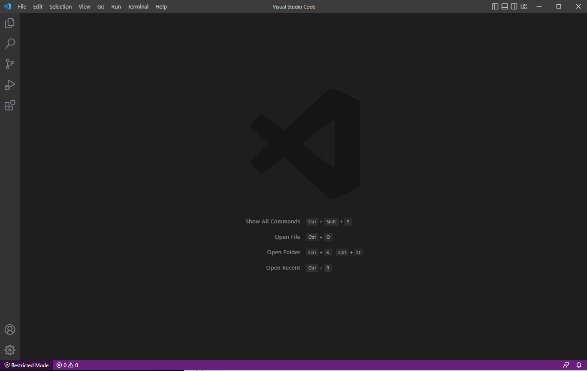

# Lab Report 1 Tutorial
## Part 1: 15l Account Setup
> [Account Lookup](https://sdacs.ucsd.edu/~icc/index.php)  
> Click on this link to reset password

1. Put in username (ex. "akhov" in akhov@ucsd.edu) & student id
2. Click on the cse15lsp23zz button ("zz" should be your own unique letters, this is your 15l username)
3. Click on the Password Change link, then proceed on clicking "Proceed to Password Change Tool"
4. Enter the 15l username and proceed with the link
5. Once the email with password instructions is sent, open it up and click on the link to the reset page
6. Enter your new password then press the Change Password button

## Part 2: Installling Visual Studio Code
(If you't dont need to or already have Visual Studio Code, you may skip this step)
>[Install Page](https://code.visualstudio.com/) 
>  Click on the link to enter install page
1. Simply follow the instructions provided on the page
2. When installed, Visual Studio Code should look something like this 

Note: Depending on the system and settings the color or menu bar may differ.
## Part 3: Remote Connection

## Part 4: Running Commands
