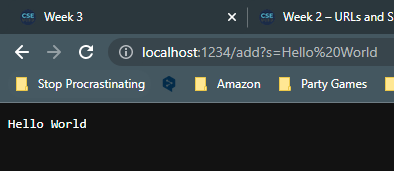
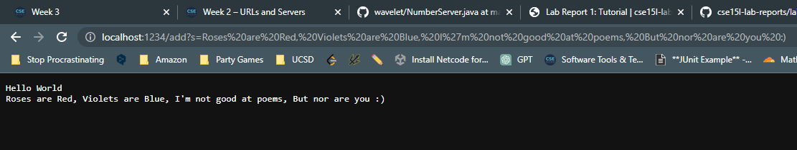

# Lab Report 2  
## Part 1: StringServer
```
//StringServer.java 
import java.io.IOException;
import java.net.URI;
import java.util.ArrayList;

class Handler implements URLHandler {
    // The one bit of state on the server: a number that will be manipulated by
    // various requests.
    ArrayList<String> stringList = new ArrayList<>();

    public String handleRequest(URI url) {
        System.out.println("Path: " + url.getPath());
        if (url.getPath().contains("/add")) {
            String[] parameters = url.getQuery().split("=");
            if (parameters[0].equals("s")) {
                    stringList.add(parameters[1] + "\n");
            }
        }
        if(stringList.size() == 0){
            return String.format("Please use /add to add the first String!");
        }

        StringBuilder output = new StringBuilder();
        for(String s: stringList){
            output.append(s);
        }
        return String.format("%s\n",output);
    }

}


class StringServer {
    public static void main(String[] args) throws IOException {
        if(args.length == 0){
            System.out.println("Missing port number! Try any number between 1024 to 49151");
            return;
        }

        int port = Integer.parseInt(args[0]);

        Server.start(port, new Handler());
    }
}
```  
**Note**: For StringServer.java to operate, I needed to import the Server.java file that Joe Politz gave us from wavelet. 
  
**Methods Called**
1. main Method of StringServer  
  * The only argument passed is String[] args which is from the user's input to the command line for the port number
2. Server.start(int port, URLHandler handler)
  * The arguments passed don't really matter, the program works the same usually
3. handleRequest(URI url)  
  * url is formed from Server.java, the url itself does not particularly matter
  * Field: ArrayList<String> stringList  

**Relevant Field Changes**
* The main field to consider is ArrayList<String> stringList because it tracks the strings added by the user and is referenced to print out its entire contents
* This specific request changes stringList from null to {"Hello World"}    

  
**Methods Called**
1. main Method of StringServer  
  * The only argument passed is String[] args which is from the user's input to the command line for the port number
2. Server.start(int port, URLHandler handler)
  * The arguments passed don't really matter, the program works the same usually
3. handleRequest(URI url)  
  * url is formed from Server.java, the url itself does not particularly matter
  * Field: ArrayList<String> stringList  

**Relevant Field Changes**
* The main field to consider is ArrayList<String> stringList because it tracks the strings added by the user and is referenced to print out its entire contents
* This specific request changes stringList from {"Hello World"} to {"Hello World", "Roses are Red, Violets are Blue, I'm not good at poems, But nor are you :)"}    

##Part 2: Lab 3 Bugs  

---
```
//**Faliure-Inducing Input**  
@Test
public void testReverseInPlace1(){
    int[] input1 = {12, 13, 7, 2, 33};
    int[] expected = {33, 2, 7, 13, 12};
    ArrayExamples.reverseInPlace(input1);
    assertArrayEquals(expected,input1);
}

//**Not Faliure-Inducing Input**  
@Test 
public void testReverseInPlace() {
    int[] input1 = { 3 };
    ArrayExamples.reverseInPlace(input1);
    assertArrayEquals(new int[]{ 3 }, input1);
}

public class ArrayExamples {
    // Changes the input array to be in reversed order
    static void reverseInPlace(int[] arr) {
        for(int i = 0; i < arr.length; i += 1) {
            arr[i] = arr[arr.length - i - 1];
        }
  }
}

```
```
static void reverseInPlace(int[] arr) {
    int temp = 0;
    for (int i = 0; i < (arr.length) / 2; i += 1) {
      temp = arr[i];
      arr[i] = arr[arr.length - i - 1];
      arr[arr.length - i - 1] = temp;
    }
}                                
```
